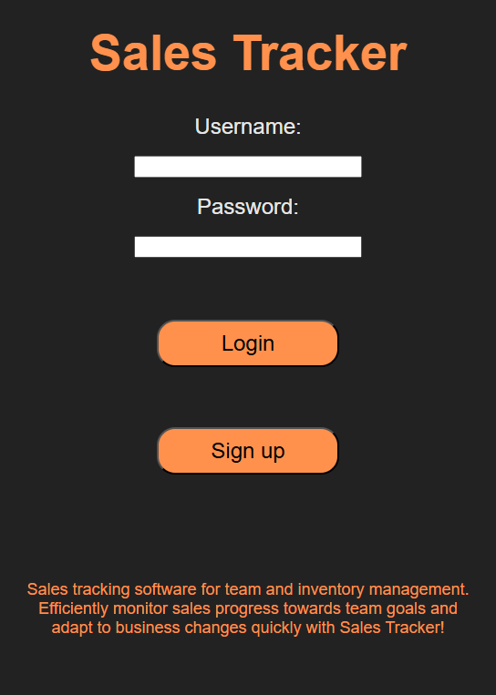
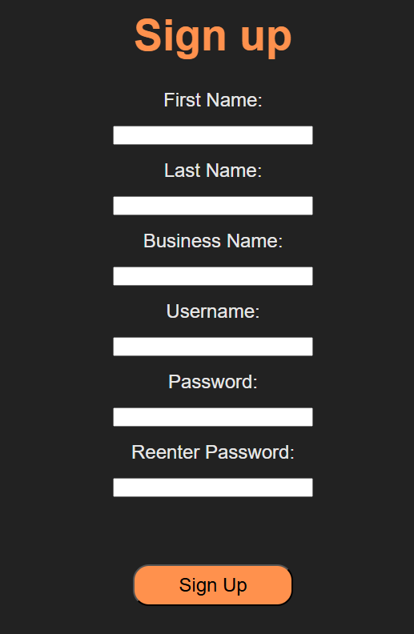
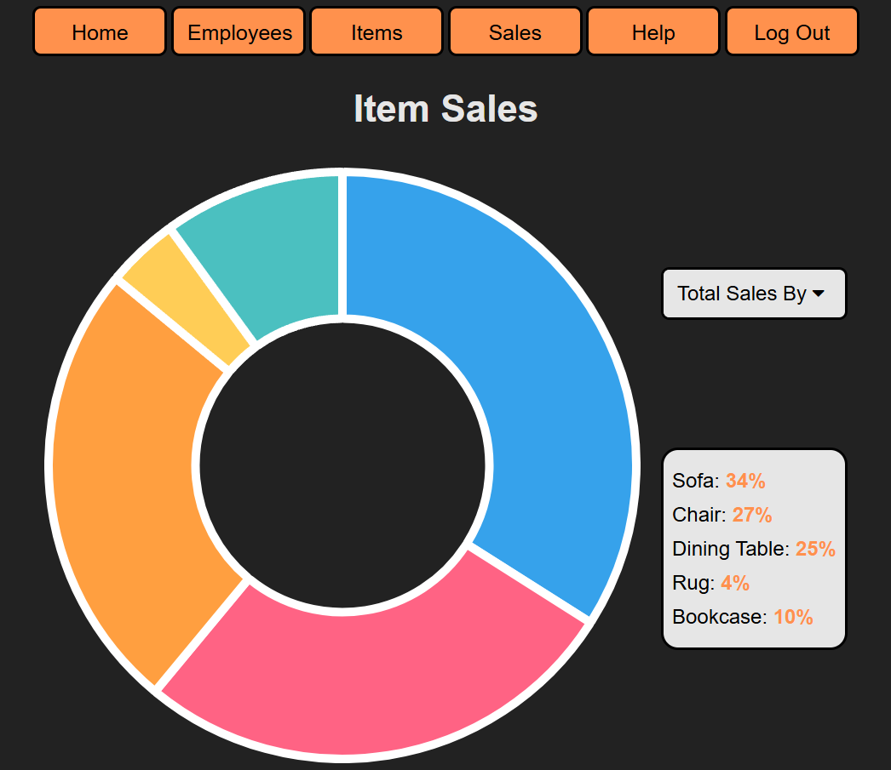
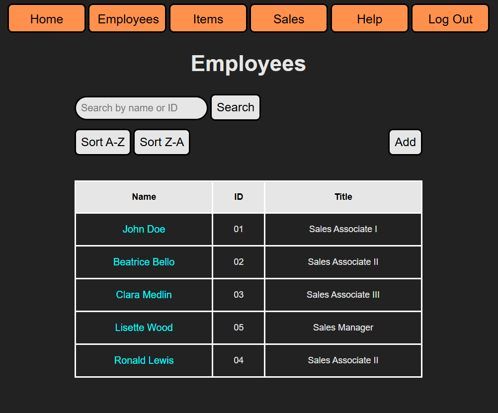
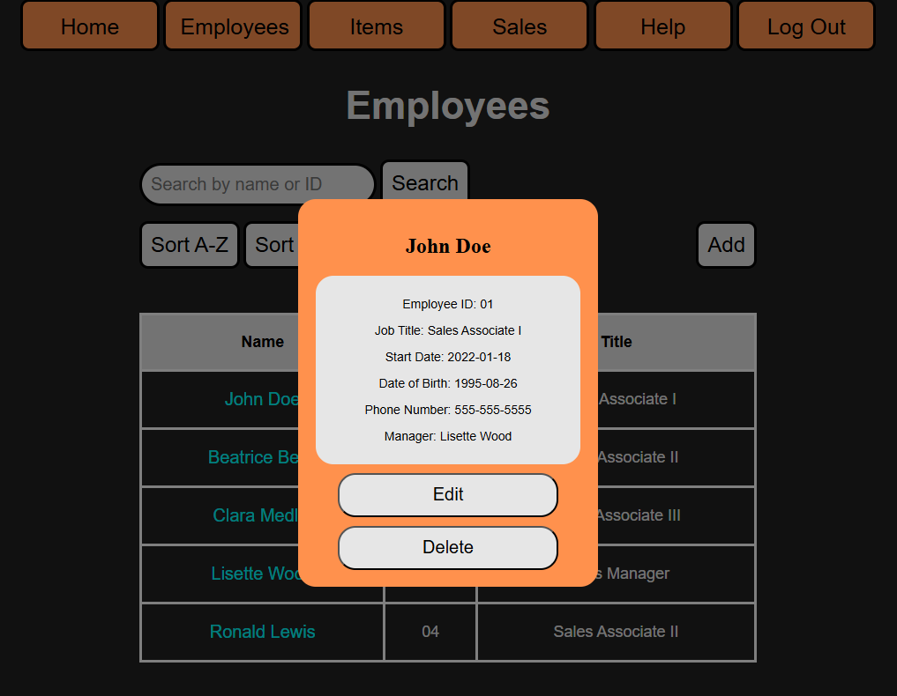
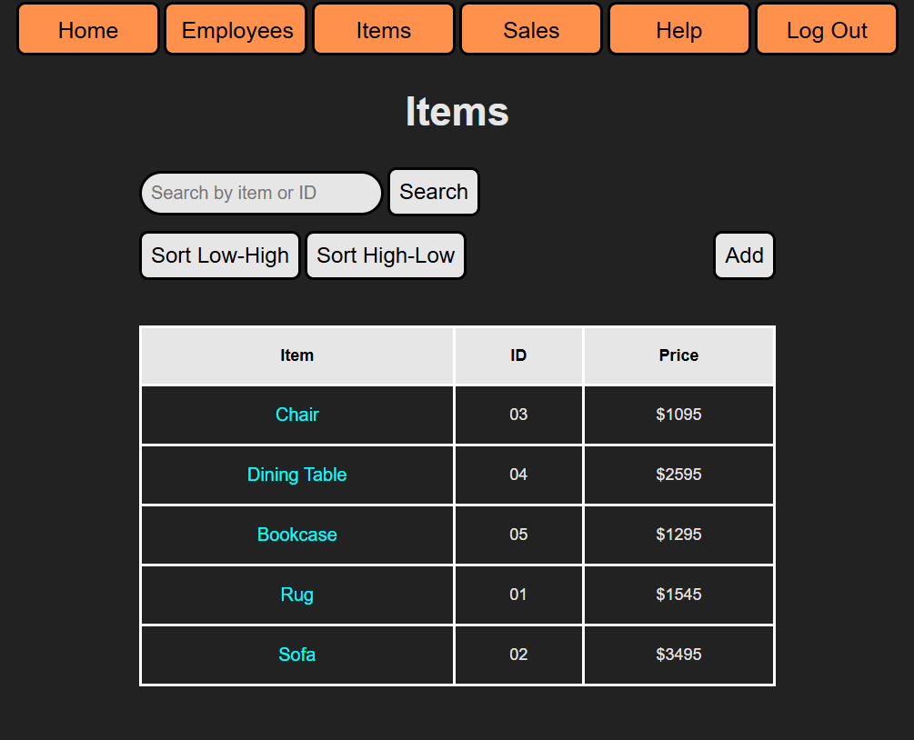
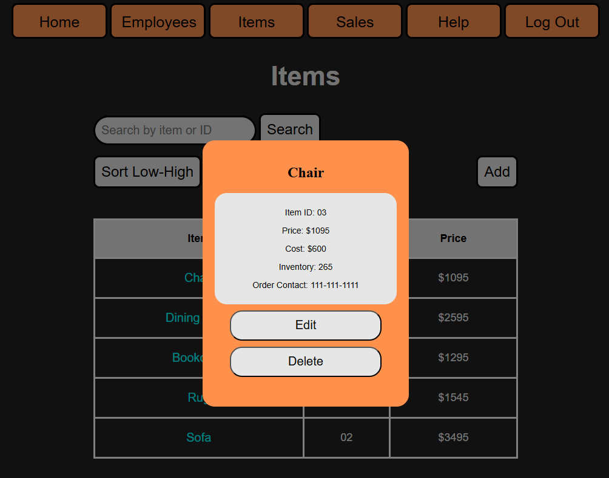
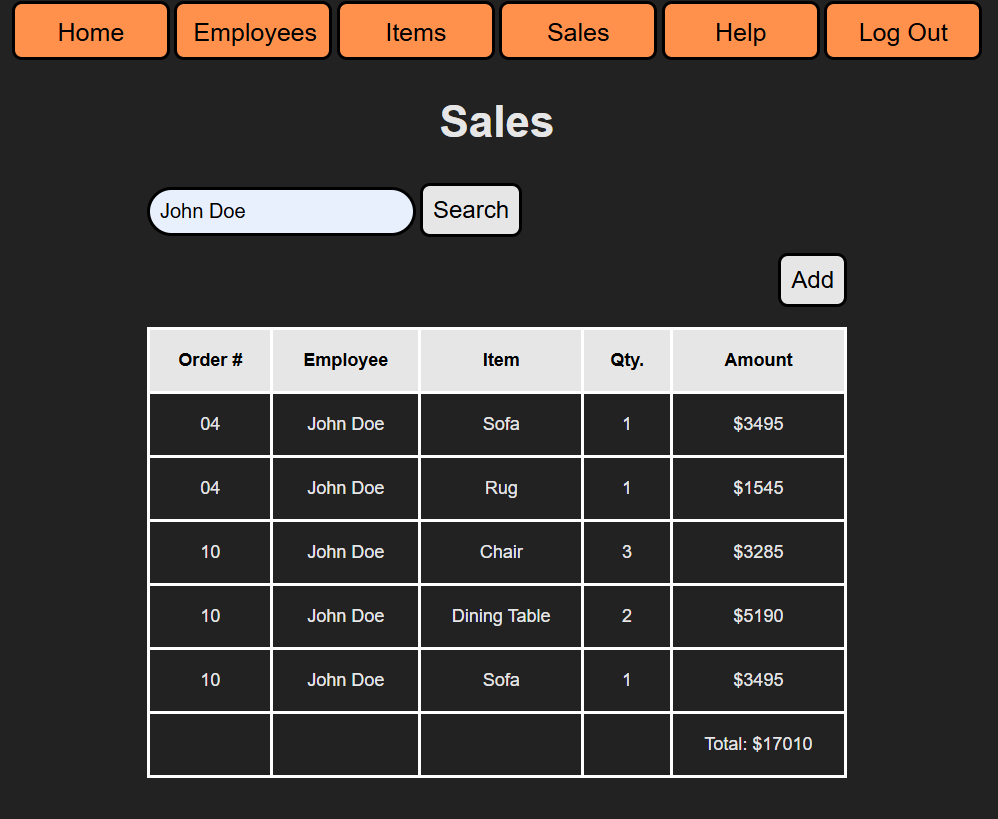
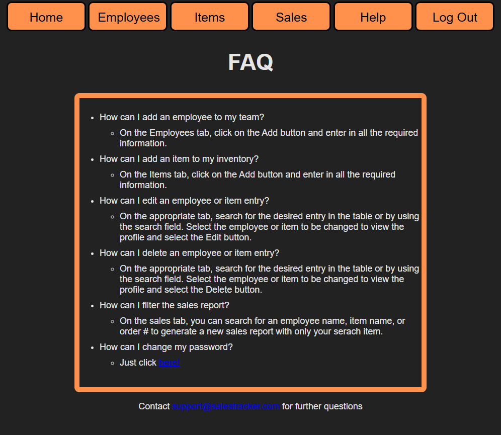

# Sales Tracker
This program allows for simple tracking of business sales and assets with a user-friendly interface.

## Description
This web app is an original project made for CS361 at Oregon State University. The project utilizes Flask for the backend, HTML/CSS for the structure, Javascript for all the interactive features, and PostgreSQL for database management. The program allows for users to register an account, where they can then keep track of business assets such as inventory and employees, as well as record pertinent sales information as needed.

The program utilizes a microservice architecture, with microservices providing the function of user credential validation and initial sign up, statistics calculation, and item sorting.

## Pages
   ### Welcome Page
   
   ### Sign up Page
   
   ### Home Page
   
   ### Employees Page
   
   
   ### Item Page
   
   
   ### Sales Page
   
   ### Help Page
   
## Authors
Tanner Dawson

## Version History
* 1.0
    * Initial Release
* 2.0
    * Completed project
